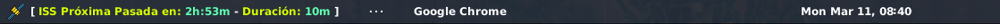

# ISS Argos
Extensión para [argos](https://github.com/p-e-w/argos) que muestra el tiempo restante para la próxima pasada de la Estación Espacial Internacional.

# How to configure

- Instalar [argos](https://github.com/p-e-w/argos)
- Copiar `iss.l.3m.py` a `~/.config/argos`
- Copiar el ícono a una carpeta diferente
- Editar las variables `ICONO`, `LATITUDE` y `LONGITUDE`.
- Enjoy it!
